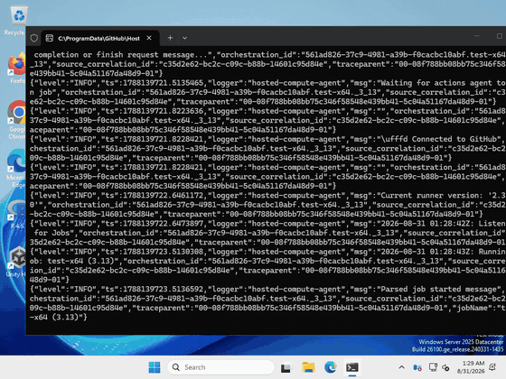
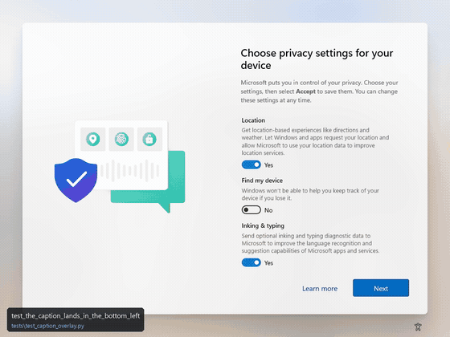

# wintegrate

**Integrate Windows desktop apps into modern CI.**

`wintegrate` (**Win**dows + **integrate**) is a Python library built to seamlessly integrate Windows GUI testing into unattended, headless CI pipelines — where no human is watching and the only evidence of what happened is whatever the run left behind.

[](https://github.com/mangokingTW/wintegrate/actions/workflows/ci.yml)
[](https://pypi.org/project/wintegrate/)
[](https://github.com/mangokingTW/wintegrate)
[](https://mangokingtw.github.io/wintegrate/)
[](https://github.com/astral-sh/ruff)
[](https://pypi.org/project/wintegrate/)
[](https://scorecard.dev/viewer/?uri=github.com/mangokingTW/wintegrate)
[](https://github.com/mangokingTW/wintegrate/actions/workflows/codeql.yml)

---

## What a CI run actually looks like

Every CI run records itself. Below is the **complete test suite** on both architectures — not a highlight reel, not a staged demo: the entire run, unedited, at 8× speed. The camera starts before the desktop is prepared, so on ARM64 the first second still shows the out-of-box privacy page the runner boots into, and then shows it being cleared, on camera, before the first test. That is the point: nothing here is assumed to be clean; it is measured, and then made so.

Each frame names the test that produced it, in the bottom-left corner, so a moment worth looking at can be traced back to the test that caused it.

| `windows-latest` (x64) — 138s | `windows-11-arm` (ARM64) — 169s |
|---|---|
|  |  |

Watch the same scenario on both. In these two runs Notepad became discoverable in 0.11s on x64 and 1.15s on ARM64 — and the same measurement on a cold ARM64 runner has come back at **17.18s**, against 0.10s on x64. That spread is the point: a discovery timeout tuned on the left-hand machine fails intermittently on the right-hand one, and the failure reads like a flaky test rather than a cold start. This is the class of problem `wintegrate` exists to make visible, and the reason the timings are written to `session_events.json` on every run rather than quoted once in a README.

The full-resolution recordings are `recording-artifacts/full-suite-<arch>.mp4`, attached to the artifacts of [every CI run](https://github.com/mangokingTW/wintegrate/actions/workflows/ci.yml), along with the window census, the event timeline, and the failure screenshots.

---

## Why wintegrate?

Most Windows GUI automation frameworks (e.g. `pywinauto`, `pyautogui`) are built for interactive desktop use on developer workstations. In unattended CI runners (`windows-latest`, `windows-11-arm`), standard interactive assumptions break down:

- **Fail-safes panic in CI**: Moving the cursor into a corner panics interactive libraries and halts test runs.
- **Stale COM wrappers**: Reusing resolved UI element references across seconds causes silent `COMError` failures.
- **Launcher PID != Window PID**: Modern packaged Windows apps (like Notepad, Terminal) launch a starter shim process that does not own the visible HWND.
- **Memory Exhaustion**: Collecting frames in memory before writing exhausts RAM — a two-minute capture at 1024x768 is over 10 GB of raw pixels.
- **ARM64 Scancode & Input Drops**: DirectX scan-code simulation fails on Windows ARM64 virtualization; keypresses are dropped without verification.
- **Multi-Window Discovery Collision**: Launching multiple instances of identical apps causes discovery diffs to select the existing instance rather than the new one.
- **Unverified fire-and-forget**: Typing without post-condition assertions hides silent failures (e.g. counting `\n` while Notepad returns `\r\n` or `\r`).

`wintegrate` is engineered specifically for **unattended CI reliability** across both **x64 and ARM64 Windows**.

---

## Core Features & Architecture

### 1. Verified Actions & Post-Conditions
Every UI interaction confirms its post-condition (line count deltas, buffer content, focus transitions) before returning:
```python
editor.type_verified(
    "Hello from CI\nSecond line\n",
    expected_line_count_delta=2,
    verify_contains="Hello from CI\nSecond line",
    delay_per_char=0.03,
)
```

### 2. Universal x64 & ARM64 Native Unicode Input
Replaced DirectX scan-code simulation with native Win32 `SendInput` utilizing `KEYEVENTF_UNICODE`. Seamlessly injects special characters, linebreaks, and multibyte Unicode across both Intel/AMD x64 and Windows 11 ARM64 virtualization runners.

### 3. Multi-Window Isolation & Discovery Exclusion
Supports launching and discovering multiple concurrent instances of the same application without PID/HWND collisions:
```python
with session.app(NOTEPAD) as app_a:
    # exclude_hwnds guarantees discovery finds the new window, not the existing one.
    # fresh=False: the leftover sweep would otherwise kill Window A.
    with session.app(NOTEPAD, fresh=False, exclude_hwnds={app_a.window.hwnd}) as app_b:
        app_a.find_text_input().type_verified("Window A\n", expected_line_count_delta=1)
        app_b.find_text_input().type_verified("Window B\n", expected_line_count_delta=1)
```

### 4. Non-Invasive Thread Input Focus (`AttachThreadInput`)
Switches foreground focus cleanly using `AttachThreadInput` synchronization between the automation thread and the target window thread. Grants activation authority without invasive keystrokes or Z-order corruption.

### 5. Windows 11 Virtual Desktop Clean-Room Isolation (`pyvda`)
Supports dynamic virtual desktop isolation. When `isolated_virtual_desktop=True`, `wintegrate` creates a clean virtual desktop on the fly, switches to it, executes test operations in isolation away from background noise, and automatically destroys the test desktop on exit.

### 6. Streaming Video & Diagnostic Pipeline
- **Recordings that show pointer, clicks, and keystrokes**: `ContinuousRecorder` draws the cursor into every frame, marks each click with an expanding, fading ring plus a coordinate crosshair, and renders a sleek key visualizer HUD (capsule badge with keystrokes and shortcut chords like `Ctrl + C`, `Win + Alt + Space`). Because everything is drawn into the bitmap after capture rather than via an on-screen window, it has zero desktop intrusion, cannot lose z-order fights to `WS_EX_TOPMOST` windows, and natively decodes Unicode `VK_PACKET` text.
- **Low-Memory Streaming Recorder**: `ContinuousRecorder` encodes in-process through PyAV, which bundles FFmpeg and is the only distribution on PyPI with a `win_arm64` wheel — so recording works out of the box on Windows ARM64 instead of asking the user to install a binary. There is deliberately no external-ffmpeg fallback: it would look like a safety net while making recording depend on something ARM64 users are unlikely to have. Frames carry wall-clock timestamps, so a capture loop that falls behind the nominal frame rate still plays back at real speed.
- **Automatic Failure Artifacts**: Automatically dumps full-screen screenshots and pre/post `window_census.json` diffs on assertion failure.
- **Event Timeline Logging**: Logs action timestamps and targets to human-readable `.log` and structured `.json`.

### 7. Managed App Lifecycle & Locale-Independent Discovery (`session.app`)
Modern Windows apps break naive launch-and-poll automation in specific, repeatable ways.
`session.app()` packages the countermeasures:

```python
from wintegrate import NOTEPAD, Session, SessionConfig

with Session(SessionConfig()) as session:
    with session.app(NOTEPAD) as app:                # cleanup guaranteed, even on failure
        editor = app.find_text_input()               # locale-independent control ladder
        editor.type_verified("hello\n", expected_line_count_delta=1)
```

- **No localized strings**: windows are matched by process image name (`Notepad.exe`),
  window class (`Notepad`), and UIA control types — none of which change with the UI
  language. Title regexes are a last-resort fallback and live once, in the `AppSpec`.
- **Single-instance safety**: Store apps (Notepad) reuse a running instance — a leaked
  instance makes the next launch open a *tab* instead of a new window, and discovery
  times out mysteriously. `fresh="auto"` sweeps leftovers before launching (CI only).
- **Cold-start headroom**: first launches of Store apps regularly exceed 10s on CI
  runners (ARM64 especially); managed launches default to a 30s discovery timeout.
- **No leaks**: the context manager closes the window and kills the process on exit,
  and a timed-out discovery kills its own launcher.

---

## Quickstart

```python
from wintegrate import NOTEPAD, Session, SessionConfig

config = SessionConfig(
    artifact_dir="./ci-artifacts",
    record_video=True,
    fps=30,
)

with Session(config) as session:
    # Managed lifecycle: locale-independent discovery, single-instance safety,
    # generous cold-start timeout, and guaranteed cleanup on exit.
    with session.app(NOTEPAD) as app:
        editor = app.find_text_input()

        # Types hardware keystrokes and verifies line count delta & text content
        editor.type_verified(
            "Hello from CI\nSecond line\n",
            expected_line_count_delta=2,
            verify_contains="Hello from CI\nSecond line",
        )
```

---

## CI/CD Integration

`wintegrate` is purpose-built to eliminate the frustration of debugging headless or unattended Windows GUI test failures on CI runners without RDP access.

### Zero-RDP CI Diagnostics

When a test run completes or encounters an assertion failure in GitHub Actions or Azure Pipelines, `wintegrate` automatically bundles a complete diagnostic package to `artifacts/`:

1. **Full-Motion Video Recording (`.mp4`)**: In-process low-overhead screen capture via PyAV, capturing the exact visual state and timing of the runner.
2. **Window Census Diff (`window_census.json`)**: Pre- and post-test snapshots of all desktop HWNDs, titles, process IDs, and visibility states — immediately revealing rogue popups, leaked instances, or focus-stealing dialogs.
3. **Structured Event Timeline (`session_events.json` / `.log`)**: Millisecond-accurate trace of every window launch, focus transition, and verified keystroke.
4. **Failure Screenshots (`.png`)**: Instant high-resolution captures of the desktop and target window at the exact moment of failure.

### GitHub Actions Workflow Example

Add GUI integration testing with automatic diagnostic artifact collection to your repository in a few lines:

```yaml
name: Windows GUI Integration Tests

on:
  push:
    branches: [ main ]
  pull_request:

jobs:
  test-windows:
    strategy:
      matrix:
        os: [ windows-latest, windows-11-arm64 ]
    runs-on: ${{ matrix.os }}

    steps:
      - uses: actions/checkout@v4

      - name: Set up Python
        uses: actions/setup-python@v5
        with:
          python-version: "3.13"

      - name: Install dependencies
        run: |
          python -m pip install --upgrade pip
          pip install "wintegrate[all]" pytest

      - name: Run Windows Integration Tests
        run: |
          pytest tests/ -v

      - name: Upload Diagnostic Artifacts (Videos & Census)
        if: always()
        uses: actions/upload-artifact@v4
        with:
          name: wintegrate-diagnostics-${{ matrix.os }}
          path: ./artifacts/
          if-no-files-found: ignore
```

### Real-World Adoption

See [`ImeModePersistence`](https://github.com/mangokingTW/ImeModePersistence) for a live production example: a Windows system utility that uses `wintegrate` in GitHub Actions CI to drive end-to-end integration tests with live screen recording, focus verification, and IME state assertions across both x64 and ARM64 Windows.

---

Full documentation: **<https://mangokingtw.github.io/wintegrate/>** — including
[what breaks in CI](https://mangokingtw.github.io/wintegrate/pitfalls/), a catalogue of the
failures this library was built against.

---

## Installation

```bash
pip install wintegrate          # core: window/element automation, verified input
uv add wintegrate
```

The core install depends on `comtypes` alone. Two optional extras pull in the
heavier pieces only if you use them:

```bash
pip install 'wintegrate[video]'    # screen recording + failure screenshots (Pillow, PyAV)
pip install 'wintegrate[desktop]'  # virtual desktop clean-room isolation (pyvda)
pip install 'wintegrate[all]'
```

Using a feature without its extra raises an error naming the extra to install, so a
missing dependency never turns into a silently skipped diagnostic.

Everything in `0.5.0` came from driving four real applications — Notepad++,
WinMerge, DB Browser for SQLite and Files — rather than a test app written for
the purpose, and those four now run as a CI release gate on both a client and a
server SKU. Each of them also has a real, already-fixed upstream bug reproduced
against the build that had it. See the [changelog](CHANGELOG.md#050--2026-09-01).

Or install from source with development dependencies:
```bash
git clone https://github.com/mangokingTW/wintegrate.git
cd wintegrate
pip install -e .[dev]
```

Windows only: the package imports on other platforms (so cross-platform tooling and
`env` checks work), but every Win32/UIA call raises a clear unsupported-platform error.

---

## Running Tests

Run full test suite locally:
```powershell
pytest tests/ -v -s
```

Run static code analysis & formatting check:
```powershell
ruff check src/ tests/
```

---

## Verifying a release

Releases are built by a GitHub Actions workflow and published to PyPI through
Trusted Publishing — no API token exists to be stolen. Every file carries PEP 740
attestations (visible on the PyPI page) and GitHub build provenance:

```bash
gh attestation verify wintegrate-<version>-py3-none-any.whl --repo mangokingTW/wintegrate
```

A pass proves the file was built by this repository from a specific commit.

This library synthesizes input, reads window contents, captures the screen, and
can terminate processes — see [SECURITY.md](SECURITY.md) for what that means when
running it unattended, and for how to report a vulnerability privately.

---

## License

MIT License. See [LICENSE](LICENSE) for details.
