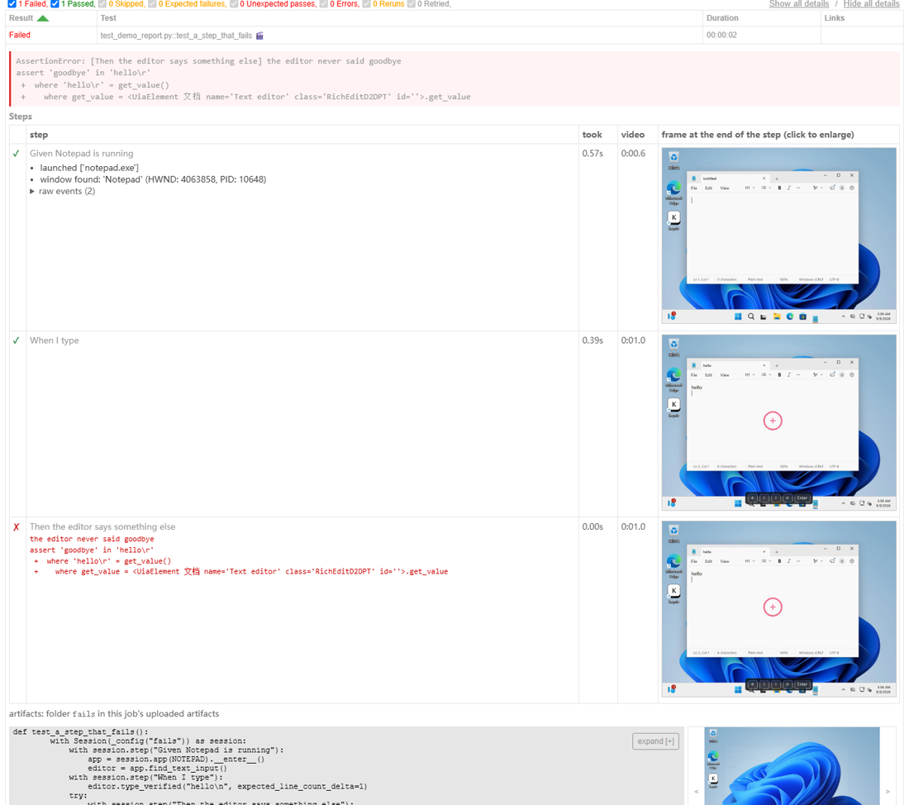

# HTML report

`pip install "wintegrate[html]"` and run pytest with `--html=report.html`. The
row for every test that opened a `Session` then carries the session's evidence,
read from the artifacts the session already writes. Nothing changes in what a
session records; the plugin is loaded through the `pytest11` entry point and
stays inert without `--html`.

## What a failed row shows, in order

1. **The last screenshot**, in the media pane, before anything has to be
   expanded. The step's own `failure-<step>.png` when the failure was inside a
   `session.step`, otherwise the session's `failure_screenshot.png`.
2. **The error**, one line: the assertion or exception that ended the test.
3. **The steps**, one row each: tick or cross, the step's name, its duration,
   its failure signature when it failed, and the frame the recording holds at the
   moment the step began. Steps nest the way they ran, and each expands to the
   events logged inside it with their arguments.
4. **The recording**, as a video the report plays.

A passing row has the same steps table, collapsed with the row.

The order is the one that lets a failure be read without expanding anything:
Playwright's report opens on the last screenshot for the same reason. One frame
per step is Maestro's device; the nested steps with their events are Allure's
step tree and Robot's keyword log.

## Where it comes from

| In the row | Read from |
| --- | --- |
| steps, nesting, durations, signatures | `step_start` / `step_ok` / `step_failed` in `session_events.jsonl` |
| events inside a step | every other journal line, by its `step` |
| frame per step | `session_recording.mp4` at the time `recording_anchor.json` maps the step start to |
| screenshot | newest `failure*.png` in the artifact directory |
| video | `session_recording.mp4`, copied into the report's `assets/` by pytest-html |

The frames need the `video` extra (PyAV); without it the table has no
thumbnails and everything else is unchanged. `--self-contained-html` inlines
screenshots and frames; the video is then inlined as well and the file grows
accordingly.

## Using it in your own suite

Nothing to register. Open sessions with `Session(...)` inside the test, wrap
work in `session.step("...")` so the table has rows, and pass `--html`. Several
sessions in one test each get their own block.

## GitHub Actions Step Summary

When running inside GitHub Actions, `wintegrate` automatically writes session
diagnostics directly to `$GITHUB_STEP_SUMMARY`:

- **High-priority failure callout (`> [!CAUTION]`)**: failed sessions prominently display the failure error and the step where the failure occurred at the top of the section.
- **Collapsible passed sessions (`
`)**: successfully completed sessions are collapsed by default with their step counts and durations, keeping the Actions job summary clean.
- **Window leak warnings (`> [!WARNING]`)**: warns if unclosed window handles remained open at session exit based on `window_census.json`.
- **Suite-level overview table**: pytest test suites conclude with an aggregated overview table summarizing total sessions, passed/failed counts, and direct pointers to failure artifact directories.
